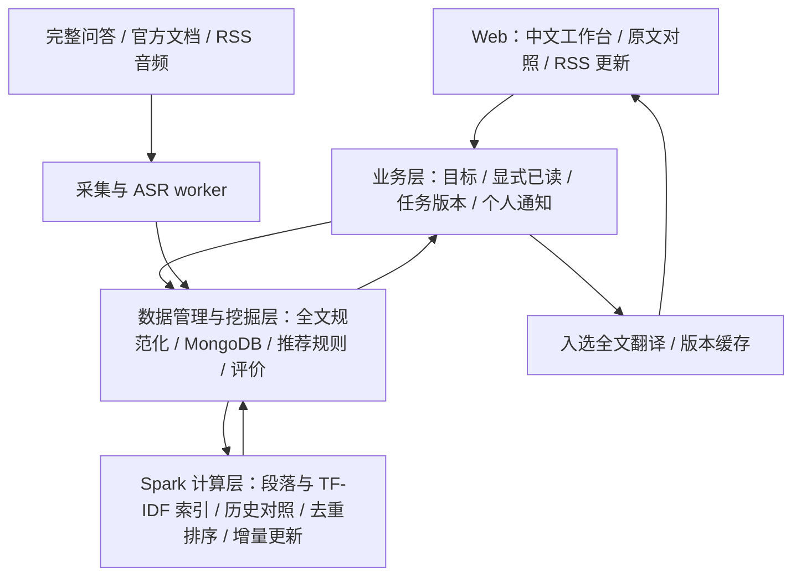

# Knowpipe

[2026-09-19 Codegraph 审查与课程改进建议](docs/codegraph-course-review-2026-09-19.md)

面向有基础的计算机专业学生的多源学习工作台：设置技术学习目标，对照显式已读资料推荐进一步阅读内容，支持中文全文与 RSS 播客。
核心计算使用 **Spark**，业务数据和批次证据保存在 **MongoDB**，Web 使用 Flask。

[已验证：当前实现] Feature 007/008/009 已实现目标和已读记录、版本化完整正文、Spark 推荐与原文对照、本地英中翻译、RSS 音频转写、增量索引及条件式个人通知。真实全文语料为 **10,215 篇、5 个原始提供方**，问答包含回答；旧 arXiv 摘要不算全文。

当前入口是 **`/learning`**。见 [MVP验证计划](plan.md)、[011 SpecKit 任务](specs/011-mvp-recommendation-validation/tasks.md)、[011 验证步骤](specs/011-mvp-recommendation-validation/quickstart.md) 和 [来源核验](evidence/009-fulltext-podcast-learning/sources-expanded.md)。009工程成果保留；010新增中文目标转换与双语召回、明确技术对象过滤、译文版本/有限质量门禁和Spark部署准备，见[010验收](evidence/010-quality-cluster-readiness/acceptance.md)。

[当前重点] MVP尚未通过产品验收。先验证目标相关性、已读对照、具体补充及中文理解是否符合需求；对应[Spec与实现差距复核](docs/mvp-spec-implementation-gap-2026-09-25.md)。规模扩展在MVP功能正确后再决定，不以历史工程任务完成替代MVP通过。

[实施中：011] 在 Spark 词汇召回后增加有界多语语义重排、候选与已读原文上下文对照，让覆盖程度和可能的补充参与选择。Web 展示实际比较范围和中英对照；语义处理失败时降级为目标推荐，不发送“补充”通知。具体进度与失败证据见 [Spec→实现→证据追踪](evidence/011-mvp-recommendation-validation/traceability.md)。

[已验证：能力边界] 语义模型仍可能误判补充，本地翻译也仍有改变技术含义的错误；模型分数、数字和代码完整性通过均不能证明知识正确。系统不能判断用户掌握程度或脑中未知的知识。历史已实测本地Spark及同机Standalone两个独立executor；当前仅一台物理电脑，跨主机扩展不在本轮MVP范围。

以下 Feature 004/006 的说明和证据记录历史路线，不代表当前学习工作台使用摘要或要求用户手工标注。

## 历史答辩演示（Feature 004/006）

```bash
python3 scripts/defense_demo.py start
# 查看已准备的本机私有演示账号：
cat state/defense/demo-account.json
```

访问 http://127.0.0.1:8019/login。后台、数据库和 Web 一起启动，已处理的节目会保留。可选 `start --public` 生成临时 HTTPS 地址；已有服务时先 `stop`，见运行手册。此脚本面向已安装 Python 依赖、Java 和 MongoDB 的 Linux/WSL；当前机器已配置。

## 历史规模、评价与跨来源关联（Feature 006）

- [已验证] 冻结真实语料并连续两次通过规模验收：**10,592 条有效 Stack Exchange + 100 条 arXiv**，重跑不增加文档数。[证据](evidence/006-scale-evaluation-linking/acceptance-record.md)
- [历史实现] 原有两任务盲标页面与指标工具保留可查；用户已经取消该标注任务。Feature 009 改用独立公开检索标签与单列的个人历史机制测试，不要求用户继续标注。
- [已验证] 播客片段支持“延伸阅读”：使用共享 TF-IDF 空间关联文献，展示关联词与原文入口；内容变化后隐藏旧结果。关联需离线刷新，不在网页请求中计算。

```bash
SPARK_LOCAL_IP=127.0.0.1 python3 -m knowpipe.linking.job \
  --mongo-db knowpipe_course_006 --output state/course-006/linking-new.json
# 查看实验库：启动后注册账号并订阅目标 RSS
MONGO_DB=knowpipe_course_006 python3 -m knowpipe.web.app
```

实验使用独立数据库，保留原演示数据。采集、规模重跑、标注和关联命令见 [Feature 006 使用说明](specs/006-scale-evaluation-linking/quickstart.md)。

## 使用

```bash
pip install -r requirements.txt
java -version  # Java 17+
export MONGO_URI=mongodb://localhost:27017
export MONGO_DB=knowpipe_mining
export SECRET_KEY='<请设置随机密钥>'
python3 -m knowpipe.web.app
```

访问 http://127.0.0.1:5000/login 注册登录。另一个终端设置同样的数据库环境变量，启动后台任务：

```bash
export SPARK_LOCAL_IP=127.0.0.1
export SPARK_MASTER='local[2]'
python3 -m knowpipe.podcasts.worker
# 单次轮询：python3 -m knowpipe.podcasts.worker --once
```

当前学习流程还需要启动推荐 worker，并配置本地模型路径；完整命令见 [Feature 009 quickstart](specs/009-fulltext-podcast-learning/quickstart.md)。RSS 每5分钟检查更新，首次最近3期；优先发布方文字稿，无文字稿时自动下载音频转写，缺模型明确显示未就绪。全部更新保留在订阅列表，与目标相关的入选资料自动准备中文；有已读历史的个人通知还须有补充比较依据。通知已读不等于文档已读。

历史播客主题模型与旧批次仍可查看；新播客全文由统一推荐 Spark worker 分析，Web 请求不启动 Spark。小型主机应按说明限制 worker 线程与 Spark 内存；单独串行验收不等于长期并行稳定性已验证。

## 公网部署

提供 Docker 多阶段镜像、Compose、Caddy 自动 HTTPS、MongoDB 持久卷，以及 Web 与后台计算独立进程。

```bash
cp .env.example .env
# 设置 DOMAIN，并分别生成 SECRET_KEY 和 MONGO_PASSWORD：
python3 -c 'import secrets; print(secrets.token_hex(32))'
docker compose config --quiet
docker compose up -d --build
```

详见 [部署与运维说明](specs/003-public-web/quickstart.md)。需要真实服务器、域名/DNS 和 80/443 入站访问。
生产模式必须使用随机密钥与 HTTPS 地址；修改 API 要求 CSRF token，Web 自动处理。数据库端口不对公网开放。

公网可访问和多机 Spark 是不同目标；默认 local[2] 仍为本机 Spark 执行。临时 Cloudflare HTTPS 已通过本环境实际访问验收；Docker 镜像构建及长期 VPS/Caddy 部署尚未验收。

## 历史技术文献管道（Feature 001/002）

先执行两个来源各 100 条的小切片：

```bash
python3 -m knowpipe.mining.spark_job --sources stackexchange arxiv \
  --target-count 100 --mongo-uri mongodb://localhost:27017/knowpipe_mining
python3 -m knowpipe.web.score_job --mongo-uri mongodb://localhost:27017 \
  --mongo-db knowpipe_mining
```

完成小切片后按 Feature 001 规约扩展至 **至少 10,000 条有效 Stack Exchange 文档**，arXiv 作为补充。采集目标可用 `--source-target-count stackexchange=10500 arxiv=500` 分别配置；实际有效数以数据库和批次统计为准，不能将采集目标当成验收结果。

文献管道用 Spark TF-IDF、KMeans 和有界候选组相似度，结果供知识单元 known/refine/new 判定。推荐分数由独立 score_job 计算；画像变化立即重判类别，排序分数需要再次运行评分作业。目前未提供定时评分调度。相似度已迁移到 Spark task，候选分组与最终结果仍需要 driver 内存，不能宣称无限扩展。

## 当前四层架构



- `knowpipe/corpus/`：完整问答与官方文档采集、来源核验、去重。
- `knowpipe/learning/`：目标、显式已读、全文版本与实际本地模型适配。
- `knowpipe/recommendations/`：Spark 索引和推荐、增量策略、任务队列与独立检索评价。
- `knowpipe/web/`：鉴权、安全、学习工作台与 API；不在请求中启动 Spark。
- `knowpipe/podcasts/`：公共 RSS/音频抓取、ASR、持久任务与条件式通知。
- `knowpipe/mining/`、`knowpipe/evaluation/`：保留的历史挖掘与标注评价工具。
- `specs/`：规格 → 计划 → 任务 → 契约 → 验收流程。
- `evidence/`：测试和运行证据，明确区分测试替身、合成样例和真实外部数据。

## 验证与答辩

```bash
SPARK_LOCAL_IP=127.0.0.1 python3 -m unittest discover -v
node --check knowpipe/web/static/app.js
python3 -m knowpipe.evaluation.metrics judgments.json --k 10
```

单元测试的数据库用 mongomock，Spark 测试使用真实 Java/PySpark；真实数据库/HTTP 验收另行留证。上述历史评价命令需外部标签；当前阶段使用冻结的公开 CQADupStack 查询和标签，不要求用户手工标注。它只能评价英文检索，不能证明中文目标或个性化学习收益。

| 规约 | 范围 | 证据 |
|---|---|---|
| [001](specs/001-data-pipeline-spark-mining/spec.md) | 文献采集与 Spark | [历史验收](evidence/001-data-pipeline-spark-mining/acceptance-record.md) |
| [002](specs/002-personalized-web/spec.md) | 个性化知识与 Web | [历史验收](evidence/002-personalized-web/acceptance-record.md) |
| [003](specs/003-public-web/spec.md) | 公网运行基础与交互 | [验收](evidence/003-public-web/acceptance-record.md) |
| [004](specs/004-podcast-insights/spec.md) | 播客订阅与分析通知 | [验收](evidence/004-podcast-insights/acceptance-record.md) |
| [005](specs/005-defense-evidence/spec.md) | 核心计算与评价证据 | [验收](evidence/005-defense-evidence/acceptance-record.md) |

[最新答辩 PPT](defense/答辩演示-20260917.pptx) · [答辩运行手册](defense/明日答辩运行手册.md) · [codegraph 分析](docs/codegraph-audit-2026-09-16.md) · [后续功能建议](docs/product-roadmap.md) · [SDD 工作流程](docs/sdd-workflow.md)
