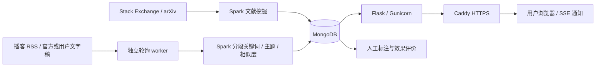

# Knowpipe

[2026-09-19 Codegraph 审查与课程改进建议](docs/codegraph-course-review-2026-09-19.md)

面向课程实践的多源知识发现 Web：技术文献挖掘、用户知识画像、播客订阅与文字稿分析。
核心计算使用 **Spark**，业务数据和批次证据保存在 **MongoDB**，Web 使用 Flask。

[已验证] 注册登录、画像/推荐 API、播客订阅、官方文字稿读取、手工补充文字稿、中英文 Spark 分析、站内 SSE 通知已实现；有自动测试与真实 MongoDB/Spark/Gunicorn 小规模验收。

[已验证] JS Party 真实编程播客已完成 RSS、HTML 官方文字稿、Spark、MongoDB 和网页验收：2 集、182 段，另 1 集等待文字稿。见 [真实节目证据](evidence/004-podcast-insights/real-programming-podcast.json)。

[已验证] 无服务器/域名的答辩演示已通过本机服务和免费临时 HTTPS 的 HTTP/浏览器验收，见 [明日答辩运行手册](defense/明日答辩运行手册.md)。永久云部署、手机独立网络访问、真实人工推荐评价仍待完成；万条主源已在 Feature 006 完成真实批次验收。完整状态见 [答辩交付状态](defense/交付状态与演示路线.md)。

## 明天答辩：直接启动当前机器的演示

```bash
python3 scripts/defense_demo.py start
# 查看已准备的本机私有演示账号：
cat state/defense/demo-account.json
```

访问 http://127.0.0.1:8019/login。后台、数据库和 Web 一起启动，已处理的节目会保留。可选 `start --public` 生成临时 HTTPS 地址；已有服务时先 `stop`，见运行手册。此脚本面向已安装 Python 依赖、Java 和 MongoDB 的 Linux/WSL；当前机器已配置。

## 本轮改进：规模、评价与跨来源关联

- [已验证] 冻结真实语料并连续两次通过规模验收：**10,592 条有效 Stack Exchange + 100 条 arXiv**，重跑不增加文档数。[证据](evidence/006-scale-evaluation-linking/acceptance-record.md)
- [已验证] 推荐评价可导出两任务盲标页面、下载人工标签并计算 Precision@10/NDCG@10。[待确认] 真实标签尚未提供，不能宣称推荐更好。
- [已验证] 播客片段支持“延伸阅读”：使用共享 TF-IDF 空间关联文献，展示关联词与原文入口；内容变化后隐藏旧结果。关联需离线刷新，不在网页请求中计算。

```bash
SPARK_LOCAL_IP=127.0.0.1 python3 -m knowpipe.linking.job \
  --mongo-db knowpipe_course_006 --output state/course-006/linking-new.json
# 查看实验库：启动后注册账号并订阅目标 RSS
MONGO_DB=knowpipe_course_006 python3 -m knowpipe.web.app
```

实验使用独立数据库，保留原演示数据。采集、规模重跑、标注和关联命令见 [Feature 006 使用说明](specs/006-scale-evaluation-linking/quickstart.md)。

## 使用

```bash
pip install -r requirements.txt
java -version  # Java 17+
export MONGO_URI=mongodb://localhost:27017
export MONGO_DB=knowpipe_mining
export SECRET_KEY='<请设置随机密钥>'
python3 -m knowpipe.web.app
```

访问 http://127.0.0.1:5000/login 注册登录。另一个终端设置同样的数据库环境变量，启动后台任务：

```bash
export SPARK_LOCAL_IP=127.0.0.1
export SPARK_MASTER='local[2]'
python3 -m knowpipe.podcasts.worker
# 单次轮询：python3 -m knowpipe.podcasts.worker --once
```

添加公开 RSS，后台每 5 分钟检查更新，完成分析后页面收到通知；页面同时每 5 秒查询持久通知以兼容不支持 SSE 的临时隧道。首轮最多回填最新三集，后续检查最近 100 集中的新节目及已有节目的文字稿更新，跳过更早的未导入历史节目（依据发布时间）。没有官方文字稿时显示“等待文字稿”，可手工补充；当前不自动转写音频。详情展示完整文字稿、分段关键词及权重、主题分组、相似片段和 Spark 批次信息。

播客使用每批次独立主题模型；其主题编号不与文献或其他批次混用。单段/重复内容明确标注词频降级。用户网页不启动 Spark 作业。

## 公网部署

提供 Docker 多阶段镜像、Compose、Caddy 自动 HTTPS、MongoDB 持久卷，以及 Web 与后台计算独立进程。

```bash
cp .env.example .env
# 设置 DOMAIN，并分别生成 SECRET_KEY 和 MONGO_PASSWORD：
python3 -c 'import secrets; print(secrets.token_hex(32))'
docker compose config --quiet
docker compose up -d --build
```

详见 [部署与运维说明](specs/003-public-web/quickstart.md)。需要真实服务器、域名/DNS 和 80/443 入站访问。
生产模式必须使用随机密钥与 HTTPS 地址；修改 API 要求 CSRF token，Web 自动处理。数据库端口不对公网开放。

公网可访问和多机 Spark 是不同目标；默认 local[2] 仍为本机 Spark 执行。临时 Cloudflare HTTPS 已通过本环境实际访问验收；Docker 镜像构建及长期 VPS/Caddy 部署尚未验收。

## 技术文献与个性化推荐

先执行两个来源各 100 条的小切片：

```bash
python3 -m knowpipe.mining.spark_job --sources stackexchange arxiv \
  --target-count 100 --mongo-uri mongodb://localhost:27017/knowpipe_mining
python3 -m knowpipe.web.score_job --mongo-uri mongodb://localhost:27017 \
  --mongo-db knowpipe_mining
```

完成小切片后按 Feature 001 规约扩展至 **至少 10,000 条有效 Stack Exchange 文档**，arXiv 作为补充。采集目标可用 `--source-target-count stackexchange=10500 arxiv=500` 分别配置；实际有效数以数据库和批次统计为准，不能将采集目标当成验收结果。

文献管道用 Spark TF-IDF、KMeans 和有界候选组相似度，结果供知识单元 known/refine/new 判定。推荐分数由独立 score_job 计算；画像变化立即重判类别，排序分数需要再次运行评分作业。目前未提供定时评分调度。相似度已迁移到 Spark task，候选分组与最终结果仍需要 driver 内存，不能宣称无限扩展。

## 架构



- `knowpipe/mining/`：文献采集、校验去重、Spark 与落库。
- `knowpipe/web/`：鉴权、安全、画像、推荐、订阅 API 与页面。
- `knowpipe/podcasts/`：受限公共网络抓取、RSS/文字稿解析、持久任务、Spark 分析。
- `knowpipe/evaluation/`：人工相关性标签的 Precision@K/NDCG@K 计算。
- `specs/`：规格 → 计划 → 任务 → 契约 → 验收流程。
- `evidence/`：测试和运行证据，明确区分测试替身、合成样例和真实外部数据。

## 验证与答辩

```bash
SPARK_LOCAL_IP=127.0.0.1 python3 -m unittest discover -v
node --check knowpipe/web/static/app.js
python3 -m knowpipe.evaluation.metrics judgments.json --k 10
```

单元测试的数据库用 mongomock，Spark 测试使用真实 Java/PySpark；真实数据库/HTTP 验收另行留证。评价输入必须由人工标注，详见 [评价说明](specs/005-defense-evidence/quickstart.md)。

| 规约 | 范围 | 证据 |
|---|---|---|
| [001](specs/001-data-pipeline-spark-mining/spec.md) | 文献采集与 Spark | [历史验收](evidence/001-data-pipeline-spark-mining/acceptance-record.md) |
| [002](specs/002-personalized-web/spec.md) | 个性化知识与 Web | [历史验收](evidence/002-personalized-web/acceptance-record.md) |
| [003](specs/003-public-web/spec.md) | 公网运行基础与交互 | [验收](evidence/003-public-web/acceptance-record.md) |
| [004](specs/004-podcast-insights/spec.md) | 播客订阅与分析通知 | [验收](evidence/004-podcast-insights/acceptance-record.md) |
| [005](specs/005-defense-evidence/spec.md) | 核心计算与评价证据 | [验收](evidence/005-defense-evidence/acceptance-record.md) |

[最新答辩 PPT](defense/答辩演示-20260917.pptx) · [答辩运行手册](defense/明日答辩运行手册.md) · [codegraph 分析](docs/codegraph-audit-2026-09-16.md) · [后续功能建议](docs/product-roadmap.md) · [SDD 工作流程](docs/sdd-workflow.md)
