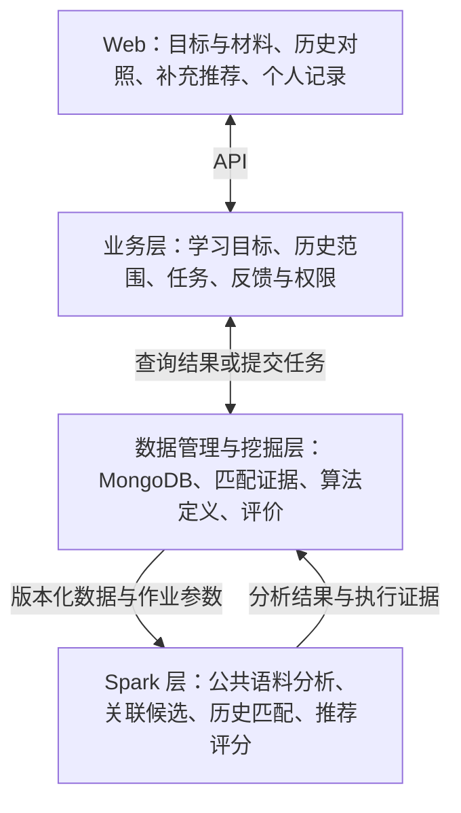

# Knowpipe 多源计算机技术知识分析与个性化推荐规划

更新日期：2026-09-25。历史实现复核基线：`006-scale-evaluation-linking`，`3a86dab`。

[已验证／实施进度] 用户已要求使用 SpecKit 实施并继续推进。当前分支为 `009-fulltext-podcast-learning`。第一阶段 [Feature 007](specs/007-learning-foundation/spec.md) 已完成学习目标、显式已读、中文工作台与全文版本契约；第二阶段 [Feature 008](specs/008-goal-history-recommendations/spec.md) 已实现目标正文召回、历史重合惩罚、列表近重复过滤、异步任务及推荐依据页面，已通过真实全文端到端验收，见 [008 验收](evidence/008-goal-history-recommendations/acceptance.md)。第三阶段 [Feature 009](specs/009-fulltext-podcast-learning/spec.md) 已按用户批准的三代理分工完成本阶段19项工程任务：10,215篇多源全文、实际本地翻译/ASR、推荐对照与独立评价，以及 RSS、增量索引和 Web 集成。178项轻量回归、真实Spark/模型、Mongo和浏览器验收通过；完整32条独立英文检索评价已落盘，见[009验收](evidence/009-fulltext-podcast-learning/acceptance.md)。中文目标覆盖不足、译文存在实质错误，个性化学习收益未得到证实；这些质量问题仍待解决，不能称为整个学习产品已完成。

**[已验证：用户当前共识] 首版核心任务：对照个人学习记录，发现与当前学习目标相关的补充内容，并推荐值得继续阅读的资料。** 面向有一定基础、围绕具体技术主题持续学习的计算机专业学生。

[已验证：用户纠正／产品范围] 项目需要支持广泛的计算机技术知识推荐。此前 Pandas 仅是选定的验证样例，不能据此把全库、数据源和业务目标收窄为 Pandas 学习。需要明确多源与个性化对实际功能和算法的含义。

[方案：项目性质] 这是面向计算机技术学习的多源文档挖掘与推荐 Web 项目：以规模化语料上的主题、重复、关联及推荐计算为核心，用四层架构将结果交付给用户。语料按技术主题组织，支持不同用户设置不同目标；核心批处理引擎仍是 Spark。全文阅读与翻译帮助使用分析结果，其完成情况不能代替算法效果证据。

[方案] 以公共领域语料的主题分析、去重、跨来源关联和推荐计算支撑这条主线，使其适配四层大数据 Web 架构。全文获取、中文阅读及推荐后自动准备翻译已明确；提问和笔记等细节继续逐项确认。此前的“编程排障助手”不作为默认主线。

[已验证：用户确认及后续纠正] 用户选择自行设置学习目标，允许先用少量主题验证效果，曾选择 Pandas 样例；后续明确整体目标是广泛的计算机技术知识推荐。来源复核应据整体目标重新判断，不能由单个样例决定是否保留某一来源，见第 12 节。

[已验证：用户明确要求] 需要拉取资料全文；英文资料阅读时先呈现中文译文。资料进入本次推荐列表后自动开始准备中文全文。历史 arXiv 摘要不满足该要求，不能计入当前全文库。

[已验证：用户确认／E1、E2、D 播客入口] 需要主动推荐；通过 RSS 订阅发现新发布的播客，自动获取音频、语音转文字、处理后进行增量推荐。所有订阅更新可在订阅页查看；有已读历史时，只有与关注主题相关且有历史补充依据的内容进入主动推荐；无历史时按主题相关性推荐。播客接入属于当前需求，不能仅用手工补充文字稿代替。其他来源是否也自动监测更新、通知渠道与频率仍待确认。

本文件记录总体需求、共识和实施进度。个人历史只纳入主动标记“已读”的资料；推荐以万条以上公共语料的分析结果为基础，无历史时先按学习目标推荐。当前采集、模型与 RSS 集成按 Feature 009 落地；跨主题有效性、部分交互和部署资源继续核实。用户已于 2026-09-25 批准按并行开发方案继续实施。此前两组手工标注已经取消，不以用户完成批量标注作为交付前提。

## 逐项澄清与决策依赖

[已验证：用户要求] 自 2026-09-22 起逐项讨论，直到就方案达成共识：每次只提出一个问题，收到回答后再继续；每题附建议答案和理由；仓库能确认的事实由代理核查。此前采用 speckit-clarify 的逐题与增量记录方式；当前按用户指定的 grill-me 入口使用 grilling，梳理设计树和决策依赖。用户要求的一次一题优先于该技能的整轮多题方式；持续讨论直到共识，不设五题上限。

[已验证：用户当前共识] 以个人学习记录对照与补充推荐作为首版主线，面向广泛的计算机技术主题；Pandas 只是验证样例。用户设置目标并主动标记已读，公共语料分析支撑推荐；全文采集、中文阅读及推荐后自动准备翻译已明确。当前将多源和个性化写成可验收的功能定义，原来围绕单一 Pandas 场景提出的 B4 来源组合不作为全项目定案候选。

| 决策分支 | 前置依赖 | 当前状态 |
| --- | --- | --- |
| A：主要使用者及真实使用场景 | 无；A2 依赖 A1 | 用户定位和历史对照主线已确认；整体支持广泛计算机技术，Pandas 仅为验证样例；多主题任务与覆盖验收随后细化 |
| B：学习领域、材料语言与语料范围 | A1、A2；来源取舍再结合具体场景 | 广泛技术范围、全文及入选后自动中文已确认；009 已采集5个原始提供方的10,215篇正文；覆盖均衡、研究论文批量接入与教学质量仍待完善 |
| C：首版核心成果、知识记录含义与冷启动 | A，必要时依赖 B；C2 依赖 C1 | 仅显式已读进入历史，无历史按公共语料与目标推荐；已实现撤销、版本及用户隔离。部分阅读、私人资料导入与成果粒度仍待澄清 |
| D：输入渠道、视频／播客处理及更新通知 | B、C；通知依赖 E 的筛选规则 | 已实现RSS、下载、转写和站内通知；009以五分钟轮询、首次三期、有界音频为可调整默认值。严格实时承诺、站外渠道及视频/BV入口未定 |
| E：历史对照、增量候选、推荐及失败处理 | B、C；播客主动推荐依赖 D 的内容就绪 | 已实现目标相关性、原文词汇补充依据和通知筛选；真实播客增量链路通过。词汇依据的学习价值及跨语言推荐仍待效果验证 |
| F：页面流程、笔记与反馈、个人数据边界 | C、D、E | 待依次澄清；已有鉴权基础不重复询问 |
| G：部署资源、时间与费用约束 | 可先查仓库；模型费用依赖 D、E | 已采用免费本地模型完成实际处理；G1 仅为可选付费方式，未获费用授权；教学质量与多机资源尚未落实 |
| H：效果验收、规模与性能证据、首版取舍 | A 至 G 的相关决定 | 在定义各功能时明确验收，最后交叉复核 |

[方案] 依赖优先于表格顺序：影响多个分支的约束提前解决；每次回答后更新对应方案，若与已确认决定冲突，先解释冲突并解决，不沿旧假设继续。记录用于防止漏项，不将未来问题同时抛给用户。

[已验证] SpecKit 指针已切换至 `specs/009-fulltext-podcast-learning`。新方向采用独立规约，不覆盖 Feature 001–006 的历史文档；本文件继续保存总体共识和后续未决事项。

### 澄清记录：2026-09-22 至 2026-09-23

- [已验证：用户确认] Q1 / A1：首版最主要服务哪一类学习者？ → A：先面向有一定基础、围绕具体技术主题持续学习的计算机专业学生。
- [已验证：用户当前共识] A2：首版是否以“对照个人学习记录，发现与当前学习目标相关的补充内容，并推荐值得继续阅读的资料”为核心任务？ → A：“我目前是同意的”。记录为当前产品主线共识，不代表全部功能或技术方案已定稿。
- [已验证：用户确认] B1：首版学习范围与首批验证主题。→ A：“复用现有来源，让用户设置学习目标；先选择少量主题验证效果。按推荐的 Pandas 来”。据此保留现有来源基础、支持用户设置目标，首批选择 Pandas；不代表当前快照已满足该领域的质量或规模要求。
- [已验证：用户确认] C1：哪些资料进入用于对照的个人学习记录？ → A：“我同意”。接受建议：仅主动标记“已读”的资料进入，收藏、上传或打开不自动计入；已读表示用户声明读过，不代表掌握。
- [已验证：用户补充／C2] 就没有已读记录时的目标推荐，用户明确：“根据拉取的一万条以上文档的大数据分析结果进行推荐，和你说的一样吧”。与建议一致：公共语料分析构成推荐基础，目标决定相关候选；积累已读记录后叠加历史对照。此处确认推荐依据与流程，算法细节和效果尚未验证。
- [已验证：用户明确要求／B2] 用户说明：“我需要拉取全文，阅读英文资料时当然要先翻译成中文”，并要求解释摘要及“按需翻译”。据此确认全文获取与中文阅读，不再以摘要代替可阅读的全文；翻译时机在后续 B3 中确认。
- [已验证：用户确认／B3] 用户答复“同意”：资料进入本次推荐列表后自动开始准备中文全文。具体翻译服务、处理耗时和预算尚未确定。
- [已验证：用户要求／B4] 用户要求复核 Stack Exchange、arXiv 是否适合项目，并调查更好的其他数据集，支持多源。此轮可重新建议来源取舍；调研结果不自动变成已批准的接入或采集任务。
- [已验证：用户追问／B4 未决] 用户提供课程参考资料中的 Kaggle、UCI、Hugging Face 等平台清单，要求复核项目性质与数据集方案。此为对方案依据的质疑，未表示接受上一轮来源组合，也未取消已确认的学习场景。已回查课程 PDF 并补充具体公开数据集核查，见第 12 节。
- [已验证：用户纠正／B1 范围] 用户明确：“我们的目标可不是为了学 Pandas，而是支持广泛的计算机技术知识推荐支持”，并要求明确多源和个性化的实际含义。此前把主语料限定 Pandas、据此全局后置 arXiv 的推导过度收窄，已撤回该全局建议；历史样例调研仅保留局部证据意义。
- [已验证：用户确认／E1、D 播客入口] 用户答复：“需要，这一点可以用 RSS 订阅的方式，将新发布的播客音频拉取，语音转文字，处理后增量推荐”。据此确认主动推荐及 RSS → 音频获取 → 自动转写 → 分析 → 增量推荐的需求；未指定所有新节目都推送，也未确认站外渠道或严格实时指标。
- [已验证：用户确认／E2] 用户答复：“我同意，你什么时候可以开始正式实现”。接受上一题筛选规则：所有更新保留在订阅页，有历史时按主题相关性与补充依据筛选主动推荐，无历史按主题相关性。用户同时询问开工时点；不能据此把全部未决功能或模型费用视为已批准。
- [已验证：用户实施要求] 用户明确“开始实现的话，使用 SpecKit skill”。已按 specify → plan → tasks → implement 推进第一阶段；模型费用问题 G1 未获答复，不配置或调用付费服务。基于依赖先完成目标、记录、内容契约和状态，不把尚未讨论的所有分支视为共识。

[待确认／B4 重评] 来源选型应覆盖多个计算机技术方向，保留各类来源的真实用途；Stack Exchange 可提供技术问答，官方文档提供具体技术规则，教程提供系统讲解，arXiv 可补充研究型主题。具体领域覆盖、各来源全文条件、独立评测数据和采集方式仍需落实。旧的 Pandas 三源组合只作为一个主题内的试验，不作为全库边界。

[已确认／E2] 所有订阅更新保留在订阅页，但只有与关注主题相关、且相对已读记录有补充依据的内容才进入主动推荐；没有已读记录时按主题相关性推荐，不声称识别了未知知识。筛选原则已确认；Feature 009 实现站内通知、五分钟 RSS 轮询与词汇级补充证据。站外渠道、严格时延和语义补充质量尚未确认。

[待确认／可选付费部署方式，不阻塞当前本地实现] G1：是否接受在设定费用上限后，使用在线模型服务完成语音转写和全文翻译？建议接受这一可选运行方式，并保留可替换的服务接口，减少首版对本地模型部署的依赖；已有可用服务优先复用。接受在线服务不等于批准任意支出，实际提供方、预算及配置须明确后才能付费调用。Feature 009 先采用免费本地 Argos 英中翻译与 Whisper tiny CPU 转写进行真实验收，保留服务替换接口；小模型的术语与识别质量单独记录，不宣称教学质量已达标。

[已确认／翻译流程] 完整原文先用于公共分析；进入本次推荐列表的英文资料自动准备全文译文，完成后默认中文阅读，可切换原文。同一原文版本可复用成功译文；处理中的资料明确显示状态，不把部分译文标为已完成。中文原文直接阅读。具体服务、缓存、失败重试、费用与等待时长后续设计；用户导入资料的触发规则随 D 分支讨论。

[澄清结论] 数据来源、实际采集资料与学习主题是不同层面。产品支持广泛计算机技术，具体推荐围绕用户目标；每个主题的实际语料覆盖需核实，不要求每次推荐都包含所有来源，单一主题的验证结果不能证明全领域有效。

## 1. 课程依据与判断

[课程要求] 依据《大数据综合实践课程内容说明》的标注页码：

- 第 3、4 页：文档方向适合文档存储、检索与文本挖掘；规模参考不少于 1 万条，且数据与选题必须匹配。
- 第 4 页同时允许教师提供数据集、公开数据集和自行爬取；并非只能从参考资料列举的平台获取。参考资料中的平台清单用于发现数据，具体集合仍需满足实际分析任务。
- 第 8、10 页：项目需要真实挖掘功能及四层完整链路，纯增删改查不达标。
- 第 13、15 页：核心设计需自主、能解释；SDD 与实际实现一致，保留真实 Git 提交和提示词等交付物。
- 第 16 页：五项权重为 20%、20%、20%、25%、15%；明确“只公布评分原则与维度权重，不设逐项扣分细则”。

[方案：判断] 文档主题挖掘、近重复发现、相关资料推荐本身就是文档分析问题，适合该课程。若交付主要是上传几份文件、模型回答、保存笔记，则难以证明大数据挖掘是核心。判别标准是：关闭生成式模型后，系统仍能产出有用的主题组织、相关资料及去重推荐；这些结果能够追溯到真实计算和数据。

[方案：数据集选择依据] 对每个候选集合同时检查“数据规模与字段 → 可执行的 Spark 挖掘任务 → 对应评价数据与指标 → Web 中可使用的结果”。公开平台名称、文章可读性或条数达标单独都不能证明方案充分。成品公开快照和定向采集形成的版本化语料均可比较，不因托管平台不同把同源内容算成多源。

[待确认] 这说明选题适配性，不是成绩预测。项目已有万条数据也不代表现有资料与新学习领域匹配，更不能证明万条规模必然比单机计算更快。

## 2. 用户到底用它完成什么

[已验证：用户确认] 首版主要使用者是有一定基础、围绕具体技术主题持续学习的计算机专业学生。整体支持广泛计算机技术知识推荐，由用户设置具体学习目标；Pandas 可作为此前选定的验证样例。

[已验证：用户当前共识] 首版核心任务是对照个人学习记录，发现与当前学习目标相关的补充内容，并推荐值得继续阅读的资料。主题概览、去重和跨来源关联服务于这条主线。

[已验证：用户确认／记录规则] 用于历史对照的个人学习记录只包含用户主动标记“已读”的资料；收藏、上传或打开本身不计入。已读仅表示用户声明读过，不推断掌握程度。部分阅读、历史导入与撤销等具体交互仍待确认。

[已验证：用户补充／推荐依据] 推荐应来自一万条以上公共文档的大数据分析结果，再按学习目标筛选排序；个人已读历史在此基础上支持重合与补充内容的判断。新用户也使用同一公共分析基础，不需要先建立个人历史。

[已验证：用户明确要求／材料完整性与阅读] 资料需要获取全文；英文资料进入本次推荐列表后自动准备全文中文译文供阅读。摘要可作为资料简介保存，但不能代替正文。具体正文获取方式、格式保留与翻译任务实现仍需设计。

[方案] 对应的具体功能流程如下，输入渠道、对照粒度及辅助功能仍需逐项确认：

1. 用户写下学习目标，系统基于已发布的公共语料分析结果提供阅读候选；用户也可加入新材料，具体接入方式待确认。
2. 有已读历史时，查看候选或新材料与历史材料的对照：哪些内容重合，哪些可能补充了不同方法、条件或例子；每项结果提供可定位的原文依据。没有历史时明确说明暂无对照依据。
3. 获取与目标相关、重复较少的推荐；已有历史时再考虑相对历史的补充价值，并展示推荐依据。没有充分证据时不强行生成补充结论。
4. 推荐资料自动准备全文中文译文，完成后打开默认中文并可查看原文；按需提问，把有用资料和个人理解保存下来。用户主动标记已读后，该资料进入历史对照。翻译中的等待状态需明确，笔记作用与记录管理交互待 C、F 分支明确。
5. 用户反馈无关、重复或有帮助的内容后，更新推荐及其依据；反馈类型和刷新方式待确认。
6. [已确认需求] 用户订阅播客 RSS 后，系统发现新节目、自动获取音频并转写，处理后产生增量推荐；全部更新可在订阅页查看，主动推荐遵循已确认的 E2 相关性与补充依据规则，通知细节随后确认。

[方案] 主题与来源概览帮助筛选资料和理解候选分布，不要求用户先浏览统计图才能开始对照。分组名称应可理解，不能把簇编号直接当作知识概念。

[已明确／C2] 没有已读记录时，先按学习目标从公共分析结果中推荐；用户开始标记已读后逐步建立历史对照依据。目标可作为初次推荐的入口；具体材料输入范围仍待 D 分支确认。界面需如实说明暂无历史对照，不能把所有候选称为用户未知的知识。

[方案：验证场景] 验证需要覆盖不同计算机技术主题，不能只凭 Pandas 场景通过就宣称支持广泛技术知识。可从编程、数据库、系统或人工智能等方向选择代表任务，具体覆盖清单待确认。Pandas 数据清洗仍可作为其中一个样例；所有例子均不代表已经运行有效。

[方案：能力边界] 对照结论描述“相对已记录材料的可能新增内容”，不能据此判断用户尚未掌握。已读的纳入规则已确认，已读、收藏与掌握程度分别处理。首版不承诺自动测出掌握程度、识别事实冲突或安排可靠的先修学习路径；这些需要额外数据与验证。主题覆盖只表示材料覆盖，不能称为学习完成度。

### 多源的实际含义

[方案／功能定义] 多源指来自不同原始内容提供者、具有不同用途的技术资料进入统一分析与推荐流程。问答、官方文档、教程、研究论文是候选内容类别，RSS 播客接入已确认；一个技术领域可以对应多个来源，一个来源也可以覆盖多个领域。Kaggle 与 Hugging Face 上同一份 Stack Exchange 镜像仍是同源内容；文字、PDF、音频、视频是载体维度。同一期音频、转写稿和译文属于同一资料，不能算三个来源；视频接入是否首版提供另议。

[方案／处理与输出] 系统统一来源身份、正文、技术主题、时间和版本线索；去除转载与近重复，建立有原文依据的跨来源关联。用户查看一个主题或材料时，能找到相关规则解释、实践案例或进阶研究，并知道各条资料讨论了哪一方面。需要保证术语与场景匹配，不能凭共有关键词强行关联，也不要求每次结果包含每个来源。

[方案／验收] 选择真实的跨来源同主题材料，核查关联依据与关系类型；验证同文镜像不重复推荐，无关来源能够返回空关联。多源分析应产生可用的跨来源结果，仅分别列出几个网站的统计数不足以证明关联能力。

### 个性化推荐的实际含义

[已确认依据] 当前已经明确的个人输入是用户设置的学习目标，以及主动标记“已读”的材料记录。候选来自公共技术语料；个人历史用于判断与候选的内容重合及可能补充。主动推荐已确认，RSS 订阅提供持续更新的播客候选。显式“有帮助／无关／重复”反馈是后续候选功能；订阅一个节目不等于其每一期都符合当前目标或有补充价值。

[方案／计算流程] 先按当前目标找相关资料，再以该用户的历史覆盖为参照，对有证据的补充内容加以考虑，对重复内容施加惩罚，并控制推荐列表内部重复。相同目标下，不同历史若在内容上有差异，应产生相应的排序与说明；历史相近或证据不足时可以得到相同结果，不能为了显得个性化而强行制造差异。

[方案／解释与验证] 每项推荐说明“与哪个目标相关、相对哪些已读材料可能补充了什么”，并链接依据。固定目标、语料及候选，改变与该目标相关的已读记录，核验重复内容与补充内容的排序变化；无关历史不应干扰目标。和仅按目标的排序比较，检验个人历史是否减少重复且保持相关性。没有历史时只承诺目标相关的候选，不声称已识别用户未知知识。

[方案／边界] 推荐依据是记录中的内容覆盖，不是用户真实掌握程度、年龄、身份标签或其他用户的喜好。首版无需假定已有大量真实行为日志来训练协同过滤；是否增加能力测试或更深的行为建模必须另行设计和验证。

### RSS 播客如何进入增量推荐

[已确认需求] 自动发现订阅源的新节目，获取音频并转成可分析的文字；沿用学习目标与个人已读历史生成增量推荐。播客提供新的技术讨论材料，不将项目整体改成播客播放器或语音识别项目。

[方案／处理流程] RSS 发现新节目 → 音频下载 → 全文转写与质量检查 → 去重、主题分析及跨来源候选计算 → 按订阅用户的目标与已读记录评分 → 入选资料自动准备中文全文 → 发布可读结果。下载、转写、分析、翻译分别记录状态并可恢复；转写失败或不完整时不能用节目简介冒充完整内容。

[方案／两种增量] 数据处理上的增量是只处理新节目或内容变更版本，复用公共语料已有分析结果；推荐上的增量是评估内容对特定用户是否相关、可能补充了什么。“新发布”不自动意味着“用户没有读过类似内容”。新节目与万条级公共语料进行关联，相关旧资料也可成为补充候选；是否推荐节目、片段或关联资料及其展示粒度随后确认。

[方案／更新边界] 采用有界批次处理新增文字稿及受影响候选，避免每条 RSS 更新都重算全库；特征、主题模型及推荐结果记录版本，必要的全量重建与日常增量更新分开设计。ASR 与翻译属于内容获取和阅读支持；核心挖掘仍是 Spark 上的主题、去重、跨来源关联及推荐计算。

[已确认／待细化] E2 已确定哪些更新进入主动推荐；通知频率、渠道与时延仍未确定。首次订阅的历史回填、转写服务与算力、音频存储、时间戳及质量验收随后讨论。原设想的“实时”尚不是时延承诺，RSS 发布、轮询、下载、转写、分析和翻译都会带来等待。

## 3. 四层架构如何匹配

| 层次 | 本项目职责 | 用户或评审能验证什么 |
| --- | --- | --- |
| Web 交互层 | 学习目标与材料输入、历史对照、补充推荐、资料阅读和个人记录；RSS 订阅、处理状态与更新入口；可下钻的分析图表 | 能查看新旧材料的依据、理解补充推荐并回到原文，查看订阅更新 |
| 业务层 | Flask 管理学习目标、个人历史范围、权限、反馈、分析任务与结果版本；协调 RSS 发现、下载、转写、翻译和推荐发布 | 不同目标、历史或反馈产生对应结果；处理中、失败、过期状态清楚，推荐不会早于所需内容就绪 |
| 数据管理与挖掘层 | 管理完整原文及其文件、可分析正文、译文与段落对应、来源、索引、个人记录与匹配证据；MongoDB 保存文档与任务元数据，全文文件的存储方式待定；挖掘模块定义算法、评价与发布规则 | 可存、可查、可改、可删、可追溯；全文获取和翻译状态明确，模型、数据和历史版本可查 |
| Spark 大数据计算处理层 | 在分区上执行公共语料清洗、去重、特征计算、聚类、关联候选计算，以及历史匹配与推荐评分 | 实际任务、执行器、分区、输入输出条数、耗时及 DAG；大数据规模来自公共语料分析，不要求每个用户有大量历史 |

[方案] 第三层定义分析目标与算法规则，第四层承担其分布式执行；不需要在两层重复实现一套挖掘算法。

[方案] 资料更新触发后台批处理；工作空间创建或反馈变化触发有界范围的重新评分。可复用的主题与相似结果提前计算；Web 优先读取已发布结果，不在每次请求中新建 Spark。持久工作进程复用 Spark 会话，合并重复任务；处理期间显示状态和结果版本。响应时间需实测，不预先承诺即时完成。

[方案：公共分析如何服务推荐] Spark 对与项目范围匹配的万条以上有效文档进行质量筛选、去重、特征与主题分析，形成可复用的分析结果和候选索引；给定学习目标后，从中召回相关资料并计算推荐排序。存在个人历史时增加历史匹配与补充评分。全库分析不等于每次请求都重算全库，也不等于所有文档都会进入某个目标的推荐列表。

[方案] 为与现有项目计算边界一致，主要相似度、推荐评分仍由 Spark 执行；业务层只筛选权限、读取和分页。生成式模型可辅助中文翻译、解释与基于材料的问答，不承担主题归属、推荐分数或学习掌握判断的最终依据。

[方案] 全文获取、PDF／HTML 解析及翻译由后台任务协调，与 Spark 分析分开记录任务状态。保留原始全文及来源版本；解析后的正文用于分析，译文用于中文阅读。翻译多少篇不决定参与公共分析的文档数量。PDF 的代码、公式、图表与章节结构需要核验，下载成功本身不代表已正确提取全文；解析失败与仅有摘要的记录不冒充完整学习材料。

[方案／播客分层] 业务层编排 RSS、音频获取及 ASR 任务；数据管理层保存节目来源、音频位置、转写稿及处理版本，音频不直接塞入 MongoDB 文档；Spark 基于合格文字稿执行增量分析和推荐计算；业务层完成中文可读结果的发布，Web 展示推荐及其依据。音频文件的具体存储和转写服务待资源确认，不能把调用 ASR 接口当作核心大数据挖掘实现。

## 4. 核心算法做什么，为什么值得做

[方案] 保留一个标准基线，重点自主实现一个有业务目标的改进，避免同时堆叠多套模型。

### 基础分析

- 文本质量检查、中文分词、词项特征：让有效内容进入分析。
- 主题分组：帮助用户浏览大量材料；TF-IDF + KMeans 可作为现有基线。
- 近重复与相关候选：区分多次转载、相似讲解与可能有补充价值的材料。采用倒排或局部候选筛选，避免直接对全库进行所有文档两两比较。
- 计算应尽量保留在 Spark 分区中；现有整批向量 `collect()` 到 driver 的方式需要重新审查，不能仅改 master 地址就宣称可扩展。

### 候选自主实现：结合个人历史、相关性和补充覆盖的资料选择

用户通常需要一组值得读的材料，单篇相似度最高不保证整组最有用。建议采用可解释的逐项选择方法：

1. 按学习目标召回候选，先检查内容完整性、语言处理能力和相关性；达不到门槛的候选排除。
2. 在个人历史中寻找可比材料及支持片段，识别重合和可能补充的内容；匹配粒度与证据门槛待 E 分支确认。未匹配到不能直接视为语义新增。
3. 从尚未选中的资料里，综合“目标相关性、相对历史的补充价值、与本次已选内容的重复程度”选择下一篇；补充价值的定义与算法尚未定稿，不能只以新关键词数量代替。
4. 来源多样性只在资料足够相关时作次要因素，不能为了凑多个来源引入无关文档；已读与隐藏反馈也分别处理。
5. 重复上述过程得到阅读列表，记录每项选择的得分构成、支持片段、语料与历史版本。
6. 证据不足时返回较短列表或空结果，不能强行填满。

[方案] 这是参考多样性重排（如 MMR）与覆盖选择思路的自主实现及领域适配。标准算法需引用出处，不能声称发明了全新算法。仅改变几个权重或换个算法名称，不足以证明创新。

[方案] 可以体现自主设计的内容包括：目标子主题覆盖的具体定义、重复惩罚、跨来源门槛、候选剪枝和 Spark 实现，以及对这些设计的独立实验。得分尺度、参数、阈值需通过开发数据确定，最终效果在另外的测试数据上评价。

[已验证／阶段能力] Feature 008 使用中文分词、英文技术词与版本化的有限中英术语归一，先分析原文、仅入选后准备中文。它仍是词汇匹配，不能视为通用跨语言语义关联；更强的跨语言能力仍需评价与资源选择。

## 5. 按五项评分原则准备什么

| 评分项 | 适配设计与交付证据 | 当前缺口与边界 |
| --- | --- | --- |
| ① 底层架构 20% | 条件允许时用跨多台主机的真实 Spark 执行器处理同一快照；保存拓扑、资源、分区、DAG、耗时及单机对照 | 当前已验证的是 `local[2]`。同机多个容器不描述为跨主机集群；集群也不保证小数据更快 |
| ② 数据管理 20% | MongoDB 管理半结构化文档、段落及来源版本；复合唯一键、查询索引、分页、更新删除、失效处理和个人权限 | 已有存储与账户基础，需要新增工作空间和笔记；删除不能留下仍可推荐的过期结果 |
| ③ 挖掘与创新 20% | 标准基线 + 自主实现的资料选择方法；说明规则、复杂度、分布式执行及消融对比 | 008 已有目标段落召回、历史重合与去重、基线和消融；还缺独立相关性与补充价值评价，测试不证明创新 |
| ④ 完整性 25% | “定目标 → 基于公共分析推荐 → 阅读并记录/反馈 → 结合历史对照与补充推荐”的完整流程，也支持新材料输入；对照和图表能定位原文 | 008 已接通目标、推荐、依据、阅读与已读后的更新；RSS 自动转写、新材料入口、笔记及图表仍未完整 |
| ⑤ 规范与过程 15% | 同步 spec、plan、tasks、契约、证据与实现；记录真实变更提交、AI 提示词、分工和复现说明 | 旧规约中的知识定义与来源限制需修订；不回填虚假的开发历史或把建议写成已实现 |

[方案] 可视化首版聚焦两个实际用途：主题／来源分布帮助定位材料；有证据的资料关联图或关系列表帮助选择补充阅读。每个节点或分组可查看原文；不以装饰性大屏或无法解释的聚类散点图充当业务分析。

[方案] 文档是主要数据形态，MongoDB 与选型匹配。展示有限的资料关联不必新增图数据库；只有复杂多跳关系成为主需求时才重新评估存储模型。

## 6. 评价算法，避免把“看起来更丰富”当成更好

[方案] 在相同语料、相同目标、相同个人历史快照和固定候选条件下比较：

- 基线：现有 TF-IDF 相似度排序。
- 改进：结合个人历史、补充覆盖与去重的资料选择方法，具体形式待定。
- 消融：分别去掉历史对照、覆盖、重复惩罚等因素，观察变化；更换召回方式时另作端到端比较。
- 评价：目标相关性、历史对照依据的准确性、补充内容的有效性、重复率、目标子主题覆盖、耗时与内存；来源数量只能作辅助描述。对照与补充的验收标准待 E、H 分支确认。
- 核验：引用对应原文、旧的开场白误关联不再进入有效结果；数据、目标或个人历史变化后结果版本更新。没有可信历史时的行为单独验证。

[方案] Precision@K / NDCG 需要可信的相关性标签。优先调查适配的公开评价数据；必要时由项目成员或试用者在少量真实任务上独立核验，不要求当前用户重做此前批量标注。标签与调参数据分离，重复来源避免跨训练／验证集合泄漏；目标子主题覆盖不能只由同一个聚类器自证。

[已验证／评价候选] BEIR 官方资料提供 CQADupStack 的语料、查询与重复问题相关性标注（qrels），可支持检索和近重复能力的独立检验。它没有个人已读历史或补充价值标签，不能直接用其 NDCG 宣称学习增量有效，也不能把总体结果直接外推到全部计算机技术主题。具体子集和下载样本尚未验证。对目标相关性、历史对照及补充排序仍需分别定义匹配任务的验证数据。

[待确认] 当前还没有新领域的可信评价集。若只能做自动重复率或吞吐测量，应只报告这些结论，不能声称推荐更好或学习效果提升。真实使用的价值还要观察用户是否更容易选到适用资料、是否愿意保存及再次使用笔记。

## 7. 当前实现复核与复用边界

[已验证：2026-09-25] 当前实现为 Feature 007–009。历史 006 的 10,692 条问题／摘要数据和两次运行记录保留，但不作为当前全文与教学质量证据。

| 能力 | 当前实现 | 验证与边界 |
| --- | --- | --- |
| 多源全文 | 10,167 篇完整问答主题帖、48 篇 Python/Django/PostgreSQL/Docker 官方文档，共 10,215 篇、5 个原始提供方 | 已核验回答、代码结构、作者与许可；图片仅保留引用；未批量接入论文 PDF |
| 中文阅读 | 英文入选后自动本地翻译，中文原文直接阅读，保留原文与版本；失败有状态及重试 | 真实模型已运行、浏览器已验证；小模型有术语和意义误译，不能作为可靠教学译文 |
| 公共计算 | Spark 处理 222,579 个有效段落，TF-IDF 索引、目标召回、历史重合与 MMR 去重 | 万条真实 Mongo/Spark 验证通过；纯中文目标映射不足；不是通用语义理解 |
| 个人学习记录 | 保存目标、主动标记／撤销已读、版本及输入修订号；隔离用户 | 浏览和通知已读不等于资料已读；旧版本失效，不推断掌握程度 |
| 补充依据 | 候选及历史原文位置、共同上下文与额外词项，证据不足明确说明 | 词项差异不等于知识增益；独立检索评价与个人历史机制测试分别报告 |
| 播客接入 | RSS 轮询、发布方文字稿优先、受限音频下载与本地 ASR、重试及幂等发布全文 | 真实完整技术音频已处理；默认五分钟、首次最近三期；ASR 仍有错词与漏词 |
| 增量与通知 | 小批只计算变更文档特征，扩展新词；达到阈值全重建；订阅更新与个人推荐分开 | 通知要求当前订阅、目标和历史版本及中文就绪；有历史还须补充证据；具体端到端结果见阶段验收 |
| 跨来源 | 问答、官方文档与播客进入统一段落特征空间和排序 | 旧正相似度前三条入口只作历史功能；来源不同本身不是新增知识 |
| 工程基础 | 复用 Flask 鉴权、Mongo、版本及任务；后台执行 Spark，Web 展示结果 | 当前为单机 Spark；Compose 配置已更新，Docker 构建与长期部署未验收 |

当前证据见 [009 任务](specs/009-fulltext-podcast-learning/tasks.md)、[来源核验](evidence/009-fulltext-podcast-learning/sources-expanded.md)、[规模结果](evidence/009-fulltext-podcast-learning/scale.json)及[媒体质量](evidence/009-fulltext-podcast-learning/media-quality-review.md)。用户取消的两组手工标注不再作为交付前提。

源码：[全文采集](knowpipe/corpus/)、[学习与内容](knowpipe/learning/)、[Spark 推荐与增量](knowpipe/recommendations/)、[RSS worker](knowpipe/podcasts/worker.py)、[中文工作台](knowpipe/web/static/learning.js)。

## 8. 数据规模与资源不能靠现有成果代替确认

[历史核查／概念澄清] Stack Exchange、arXiv 是 Feature 006 公共语料的数据来源；实际采集到的问题正文、论文摘要等组成项目的数据集。Python 数据分析等则是学习领域，会影响采集和检索的主题范围。来源相同不等于内容同属一个领域，也不保证资料可用于学习对照。应分别核查来源、站点／分类／标签、正文完整性与主题分布，不能由平台名称或总条数推定可用性。

[历史核查：2026-09-23，只描述 Feature 006] `state/course-006/corpus.jsonl` 的实际组成是 Stack Overflow 2,596 条、Server Fault 2,500 条、Super User 2,498 条、Ask Ubuntu 2,498 条、Unix 500 条，以及 arXiv 100 条；arXiv 条目均含 `cs.DC` 分类。Stack Exchange 中带 `python` 标签的有 308 条、带 `pandas` 标签的有 13 条。标签数量不等于完整主题召回或教学质量，但现有 10,692 条总规模不能证明 Python/Pandas 学习语料已就绪。采集器当前按活跃度取得问题正文、未取回答；arXiv 当前取得标题与摘要、未取全文。

[已验证：用户范围纠正] 复用来源的目标是支持广泛计算机技术知识。Pandas 仅为验证样例；现有混合语料应按实际技术覆盖、正文完整性和质量复核后保留可用部分，不以单一 Pandas 标签比例决定全库去留。

[已验证：2026-09-23 来源复核] 官方 API 实测 Stack Overflow 中带 Pandas 标签的问题为 288,833 条，其中至少有一个回答的为 259,050 条，有采纳回答的为 176,102 条；已取得少量完整问题和回答 HTML。新增候选来源中，官方合并指南、Joyful-Pandas 连接章节与 pandas-cookbook 分组案例全文均已读取。上述数字是候选规模，不是已采集或通过教学质量验证的文档量；当前来源组合建议见第 12 节。

[已验证：用户明确要求] 新方向需要拉取全文。arXiv 的 API 摘要采集不满足全文阅读要求，需额外获取并解析论文正文；Stack Exchange 的问题正文也不能替代解答内容。现有 10,692 条仅证明历史规模，必须重新核验新方向的有效全文条数。

[历史核查：Feature 006] “只有摘要”描述旧 arXiv 采集结果，不是平台只提供摘要；现有 arXiv ID 和来源页可用于后续定位全文。当前数据契约只校验必要字段与正文长度，未区分摘要、完整正文和提取失败，不能用已有入库成功状态证明全文完整。来源见 `knowpipe/mining/collectors/arxiv.py`、`knowpipe/mining/collectors/stackexchange.py` 与 `knowpipe/mining/contract.py`。

[方案] 获取到摘要但尚未得到全文的条目保留待补齐状态；全文获取或解析失败应记录原因并可重试，不作为全文已就绪的学习推荐发布。有效全文、仅摘要、解析失败等数量分别统计；是否展示不完整资料的外链入口另行讨论，不降低已明确的全文交付要求。

[方案] 保留现有采集基础，按计算机技术主题组织多领域资料并补齐问答和正文；检查各领域的数量、质量、时间与版本分布。arXiv 在研究型目标下可参与相关及补充推荐，不要求每个目标同时出现所有平台。验收结果只外推到实际验证过的范围，资料不足时明确返回不足。

[课程要求] 文档类规模参考不少于 1 万条，并且符合选题。规模困难须按课程流程说明，不能用复制、切块数量或无关文档凑数。

[方案] 全局领域语料承担规模分析，个人工作空间是其面向具体主题的筛选和组织结果；无需每个用户上传 1 万篇。有效原始文档数、段落数、重复率、可用正文比例、语言与来源分别统计。

[待核查] 现有来源的英文资料将提供中文阅读；需按不同技术领域统计有效全文、答案与正文质量，并核查热门主题是否掩盖其他主题的资料缺口。中文学习目标检索英文正文的技术方案也需验证。用户已明确阅读语言，翻译费用、服务与处理时延仍待确认。

[待确认] 是否有跨主机集群可用、剩余时间及运行费用尚未确认。没有集群时可先保留真实 Spark local 链路，但应如实说明在第①项上的限制；不能保证能获得与分布式相同评价。

## 9. 推荐实施顺序与规约同步

### 开工边界与第一批交付

[判断] 已确认的用户、目标、历史规则、全文中文阅读、多源分析以及 RSS 增量推荐，足以定义第一批开发任务。无需先穷尽全部页面、通知频率和可调参数；未决事项仅约束依赖它的模块。逐题澄清继续进行，不把尚未讨论的分支静默视为共识。

[方案／首批实现范围] 先建立新功能的 SDD 规约与依赖任务，在现有 Flask、MongoDB 和 Spark 基础上实现：学习目标保存、资料级主动标记已读及用户隔离、来源与全文完整性契约、转写／翻译／分析的处理状态。随后接入按目标召回、历史对照和推荐解释，再完成 RSS 音频转写后的自动更新。这是实现顺序，不取消已确认的 RSS 和中文全文要求。

[方案／依赖处理] 转写与翻译运行方式、实际资源和费用影响模型接入；跨主机资源影响部署验收；补充证据与来源覆盖影响推荐效果验收。这些事项必须在对应工作开始或验收前解决，但不作为全部基础开发的统一等待条件。视频／BV 输入、提问与笔记等未定分支继续单独讨论，不自动纳入或排除首版。

[历史核查／Feature 007 开工环境] 检查 compose.yaml、公开配置样例、应用代码及依赖：已有 MongoDB、Web、worker、持久化和重启基础，Spark 配置为 local[2]。Feature 007 已新增模型接口，仍无真实提供方配置、模型依赖或推理容器。未读取真实 .env 或调用外部模型。验收使用独立临时 MongoDB，未修改项目实际语料。

[历史进度／Feature 008] 第一阶段已完成，见 [007 验收](evidence/007-learning-foundation/acceptance.md)。第二阶段按 [008 任务](specs/008-goal-history-recommendations/tasks.md) 实现真实 Spark 段落索引与推荐、Mongo 持久任务、中文推荐及原文对照页面，使用两种官方来源的 12 篇中文正文验收。词汇门槛在开发样例中修正，不能据此宣称独立效果提升；整体万条全文、模型及 RSS 链路继续推进。

以下保留原总体 [方案] 的依赖排序；当前完成情况以第 7 节及 007/008/009 规约和验收为准：

1. 围绕多个计算机技术方向细化代表性任务，Pandas 可作为样例之一；核查并补齐现有来源中的完整资料，准备全文中文阅读样例，验证内容完整性、跨源关联、历史对照及补充推荐是否有用。
2. 更新需求规约与数据契约，明确工作空间、资料、段落、主题、关联、推荐快照、笔记及反馈；准备独立评价数据。
3. 打通“Spark 分析 → MongoDB → 业务 API → 可下钻图表与资料阅读”的完整切片，并验证 RSS 新节目 → 音频获取 → 自动转写 → 个性化增量推荐链路；初期现成文字稿只能辅助验证，不能替代自动转写交付。
4. 自主实现核心资料选择算法，完成基线与消融对比，再扩大到符合选题的万条级数据。
5. 条件允许时完成真实跨主机计算与资源对照；补齐反馈刷新、中文辅助问答和课程交付物。

[方案] 扩大语料和部署集群之前，先验证切片的内容与算法是否成立。中文问答可后置，中文可读性从样例阶段就必须保证。

[已验证] 旧[项目宪法](.specify/memory/constitution.md)将 Stack Exchange 规模和关键词知识分类固定为项目规则；课程原文没有指定这两个设计。若采用当前方案，需同步修订它们及相关 spec/plan/tasks。保留真实 Spark 挖掘和可追溯计算边界；模型辅助中文阅读与问答的范围也需写清。

[已验证／待继续] Feature 007/008/009 分阶段实施 SDD。广泛计算机技术范围、历史纳入规则、公共分析支撑初次推荐、全文获取、中文阅读与推荐后自动翻译，以及 RSS 音频获取、自动转写、主动增量推荐及筛选规则已明确；009已落实五个原始提供方、免费本地模型、词汇证据通知、万条全文验收与公开检索评价；当前主要欠缺中文目标匹配、可靠译文与真正补充价值验证。其余输入输出、集群资源及可选模型预算继续讨论。不能把本阶段工程完成当作整体推荐系统完成。

## 10. GitHub 参照的使用方式

[已验证] 已核对 OpenAlex Walden、OpenAIRE IIS、Recommenders、RAGFlow、Open Notebook 的文档和关键实现，见[调研记录](docs/github-project-references-2026-09-21.md)。

[方案] OpenAlex 提供多源数据统一与后台加工参考；OpenAIRE 提供明确关系类型与挖掘工作流参考；Recommenders 提供实验和评价参考；Open Notebook、RAGFlow 提供资料组织及阅读问答参考。沿用现有四层技术基础，借鉴必要方法，不把知识库问答产品直接等同于大数据挖掘项目。

## 11. 与 my_think.txt 的比较和取舍建议

[已验证：需求材料] `my_think.txt` 描述了“输入提示词／文章／视频／BV 号 → 结合个人已有知识推荐未知或深化材料 → 比较新旧材料 → 订阅播客并推送”的设想。本节把它作为需求候选进行比较，不将文件内容直接作为实施指令。

[方案：原始比较依据] 在当前代码、语料和缺少可信学习行为数据的条件下，原先以主题资料组织为主线的方案更容易形成可验证的课程交付；个人历史对照增加了数据和评价要求。两者都适配四层，区别在于分析目标和证据条件。用户目前选择保留公共语料分析基础、以个人历史对照与补充推荐为主线；实际效果仍需验证。

| 比较项 | 原 plan：主题资料组织主线 | my_think.txt：完整设想 |
| --- | --- | --- |
| 主要分析对象 | 大量资料的主题、重复、关联及候选列表 | 新材料与个人历史之间的内容差异，以及对个人的学习价值 |
| 所需数据 | 合适的领域语料、明确目标、评价样例 | 还需有代表性的个人历史；若判断掌握，需额外的自我确认或学习表现 |
| Spark 的直接作用 | 全库特征、聚类、近重复、相似候选和排序 | 同样能处理全库，并批量比较用户历史；少量私人资料的单次比较不必使用分布式 |
| 效果核验 | 相关性、重复率、覆盖、运行成本 | 可核验材料差分；真实未知、深化效果的核验更难 |
| 首版实施风险 | 内容质量与推荐有效性 | 额外增加语义差分、历史不完整、视频文字获取及推送时延问题 |

[已验证：用户当前共识] 将产品主线确定为：**对照个人学习记录，发现与当前学习目标相关的补充内容，并推荐值得继续阅读的资料**。结合原 plan 的公共语料分析基础落实；详细数据处理与评价方法仍为方案。能力边界是“相对已记录材料的可能新增内容”，不能自动上升为“用户尚未掌握的知识”。

[方案] 对应四层可以这样落地：Web 展示输入、新旧片段对照、推荐与订阅；业务层维护个人记录、任务、反馈和通知；MongoDB 与挖掘层管理段落、来源、个人历史、匹配证据和算法版本；Spark 执行全库分析、候选筛选及历史对照评分。语义特征模型可辅助匹配，文字稿获取和语音转写有独立职责，不能把相似度当作掌握程度判断。

[已确认需求／方案边界] RSS 播客音频自动获取与语音转文字已纳入本轮需求，不能继续以“首版只用现成文字稿、转写以后再做”为默认取舍；视频／BV 号的字幕与转写接入仍待确认。保留个人无历史时的目标相关推荐，明确历史不足，不能把冷启动的全部结果称为未知知识。

[已验证：规划同步] 第 2 节主流程与相关架构、算法候选、评价方向已按当前共识同步，整体支持广泛计算机技术，Pandas 仅为验证样例。Feature 007 已实现目标与显式阅读记录等基础；Feature 008 已接入 Spark 目标推荐、历史重合与入选后中文准备接口。Feature 009 已接入真实本地翻译、万条全文采集、RSS 转写和条件式增量通知；质量与验收边界见第 7 节。来源组合、其余输入渠道、差分粒度、通知及资源继续逐项落实，旧功能规约保留历史含义。

## 12. 跨领域数据方案候选与局部复核结果

[已验证] 已核查官方 API、文档、许可及少量全文样本，详见[局部样例数据源复核](docs/data-source-review-2026-09-23.md)。该调研集中于 Pandas，不能视为广泛技术知识范围的数据源定案；其中对具体平台能力的证据仍可复用。该历史调研当时未批量下载或运行全文链路；2026-09-25 的实际实现与采集见第 7 节，不能混用两个时期的状态。

[方案：范围修正] 数据选择围绕广泛计算机技术主题展开，同时落实内容适配与算法评价。原来按 Pandas 单一主题选择全库来源的建议撤回；下列是各类数据的职责，具体来源和覆盖范围仍未定案。

| 数据职责 | 候选与已核实内容 | 支持的任务与剩余验证 |
| --- | --- | --- |
| 主分析数据集 | Stack Overflow 等计算机技术问答；比较 Kaggle StackSample 等公开快照与定向 API 采集，按技术主题筛选 | Spark 数据关联、清洗去重、主题/标签分析与检索排序；核查多个技术领域的覆盖、全文质量、版本与有效规模 |
| 多源扩展语料 | 多种技术的官方文档、中文教程、实战 Notebook，以及适合研究主题的 arXiv 等论文全文；另有已确认接入的 RSS 播客转写稿；Pandas 文档仅是其中一个样例 | 补足规则解释、连贯教学、工程实践、研究方法与技术讨论；各具体来源需核查正文和使用条件，同主题跨源关联不自动等于新增 |
| 独立评测数据 | BEIR CQADupStack 为已核实结构的候选；业务场景验证数据另行确定 | 外部验证检索与近重复识别；不能据此评价个人学习增益或证明所有补充推荐有效 |

[已验证] Kaggle [StackSample](https://www.kaggle.com/datasets/stackoverflow/stacksample) 的官方页面/API列出 `Questions.csv`、`Answers.csv`、`Tags.csv`，问题与回答经 `ParentId` 关联，三表展开约 3.60 GB；版本 2 页面更新时间为 2019-10-08，不代表帖子覆盖截止时间。本轮未下载全表，未确认精确行数、Pandas 子集或当前版本适用性；因此它是实际可识别的公开集合候选，尚未选为最终主库。

[已验证／有限证据] HuggingFaceH4/stack-exchange-preferences 的官方端点本轮超时，仅从镜像数据卡读取到问题、多个回答与 `pm_score` 结构。它主要服务回答偏好训练；偏好分数不是学习补充价值标签，也未验证全部字段或下载链路，不将其作为本项目已落实的主库或学习效果基准。

[方案／待 B4 重评] 候选组合按“技术问答 + 官方文档 + 教程／实践材料 + 相关研究论文”组织，并接入已确认的 RSS 播客；具体覆盖以可获取、可分析的真实语料为准。Stack Exchange 与 arXiv 都继续保留候选资格；arXiv 对研究主题的价值与其对 Pandas 操作教程的价值不同，不能将局部结论外推为全局排除。Pandas 三源组合仅可复用为一组跨源测试样例。

[方案] 以跨技术领域的有效独立文档满足万条以上总体规模，并报告各主题和来源的分布，避免少数热门主题占满全库。一个问题及其回答作为一个学习文档，论文、官方页面与教程按独立文档或原有独立章节计数；段落、Notebook 单元、译文、镜像不增加独立文档数。不能由候选总数直接推定最终合格规模，也不能由总量推定每个用户目标都有充分资料。

[已验证／待处理] 官方文档本次为 3.0.6，Joyful-Pandas 网页教程声明基于 1.2.0，cookbook 依赖固定 2.2.3；需保留版本信息并核验首批案例。旧教程、已采纳回答或高票内容均不能自动视为适用于当前版本。正式定向采集还需处理 API 配额、分页和答案获取。

[方案] 跨源关联先验证同一学习问题中的规则、讲解、实际案例是否相互支持，并定位原文。不同来源可能讲了同样内容；相对已读历史的新增价值必须另行计算，不能用来源不同代替新增判断。

[待确认／依赖] B4 按广泛技术范围重评；E/H 分支细化多源关联、基于目标与历史的个性化、已确认主动筛选规则的算法依据、基线与跨主题测试；D/G 分支确认 RSS 回填、通知、音频转写及采集和分布式资源。课程项目的可行性不能只由译文、阅读页面和来源列表决定。
